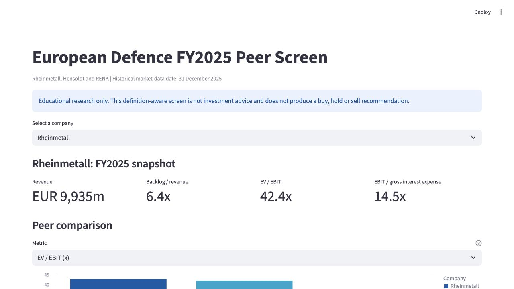

# European Defence: Valuation, Order-Book Growth & Credit Analysis

A reproducible equity-, valuation- and credit-research case study on the
European defence sector. The peer universe is Rheinmetall, Hensoldt and Renk.

## Dashboard preview



## Current research snapshot

The first source-checked FY 2025 fact base is complete for revenue, reported
profitability, order backlog and a definition-aware credit extract. It is
intentionally **not yet an investment recommendation**: valuation still
requires a dated market-data input and further reconciliation work.

| Company | Revenue | Reported profitability metric | Order backlog | Backlog / revenue |
|---|---:|---:|---:|---:|
| Rheinmetall | EUR 9,935m | Operating result: EUR 1,841m | EUR 63,800m | 6.4x* |
| Hensoldt | EUR 2,455m | Adjusted EBITDA: EUR 452m | EUR 8,833m | 3.6x |
| Renk | EUR 1,366m | Adjusted EBIT: EUR 230m | EUR 6,680m | 4.9x |

\* Rheinmetall's stated backlog includes framework agreements, so this ratio
must not be compared mechanically with the other companies.

Read the detailed interpretation in
[`research/02_fy2025_initial_observations.md`](research/02_fy2025_initial_observations.md).
The credit-ranking guardrail is documented in
[`research/03_credit_framework.md`](research/03_credit_framework.md). The
audited credit extracts, including Hensoldt's reported net-cash position,
Rheinmetall's reported net-liquidity position and their definition caveats, are in
[`research/04_credit_evidence.md`](research/04_credit_evidence.md).

## What it does

For each company, the analysis will calculate:

- EBITDA margin
- Net debt / EBITDA
- Enterprise value / EBITDA
- Interest coverage
- A definition-aware EV / EBIT valuation screen

It produces a ranked screening table and supports a short investment / deal
summary. The current `sample_companies.csv` is a technical demonstration only;
it will be replaced by source-checked reported data.

## Why this project

This is a learning portfolio project for Corporate Finance, Investment Banking,
Credit Research and Capital Markets applications. The final project will cite
the relevant annual reports and record the exact reporting period for each
input. It is educational work, not investment advice.

## Run locally

You only need Python 3:

```bash
python3 src/analyze.py
python3 src/build_fact_base.py
python3 src/check_credit_readiness.py
python3 src/build_valuation.py
python3 -m streamlit run src/dashboard.py
```

The technical screening demonstration is written to `output/screening_results.csv`.
The source-checked defence fact base is written to
`output/fy2025_fact_base.csv`.
The date-aligned valuation screen is written to
`output/fy2025_valuation_screen.csv`.
The interactive dashboard reads the versioned input data directly and shows the
historical FY2025 peer screen in your browser. Install its dependencies with
`python3 -m pip install -r requirements.txt` if Streamlit is not already
available.

## How to discuss this in an interview

> “I built a source-backed peer screen for Rheinmetall, Hensoldt and Renk.
> Before calculating ratios, I retained each issuer's reported metric and
> checked whether the definitions were comparable—for example Operating Result,
> Adjusted EBITDA and Adjusted EBIT. That meant the analysis was auditable and
> avoided presenting unlike measures as directly comparable. Only then did I
> assess backlog, profitability, leverage and valuation in the peer memo.”

## Project workflow

1. Collect financial data from official annual reports into a source register.
2. Standardise financial metrics and make each calculation auditable.
3. Build a date-aligned comparable-company table and valuation range.
4. Write a two-page investment memo with a clear thesis, catalysts and risks.
5. Add charts and a small Streamlit dashboard only after the analysis works.

## Method — how to explain this project

1. **Peer selection:** I chose Rheinmetall, Hensoldt and Renk because all three
   benefit from European defence spending but have distinct exposure to land
   systems, defence electronics and propulsion.
2. **Source discipline:** I collect only public company disclosures and record
   every metric with its URL, reporting period and definition in the source
   register.
3. **Comparability before calculation:** I retain company-specific labels such
   as Operating Result, Adjusted EBITDA and Adjusted EBIT until their
   definitions can be reconciled. I do not present unlike measures as directly
   comparable.
4. **Investment conclusion:** Only after that reconciliation do I compare
   operational growth, leverage, valuation, catalysts and risks in the memo.

This is the same basic workflow used in equity research and corporate-finance
analysis: establish a source-backed fact base, standardise carefully, calculate
transparent metrics, then form a conclusion.

See `research/01_project_brief.md` for the exact research question and
`research/investment_memo_template.md` for the final written deliverable.
Read the valuation assumptions and outputs in
[`research/05_valuation_method.md`](research/05_valuation_method.md).
The evidence-based thesis, catalyst and risk screen is in
[`research/06_investment_case_screen.md`](research/06_investment_case_screen.md).
The finished historical peer memo is in
[`research/07_peer_investment_memo.md`](research/07_peer_investment_memo.md).
